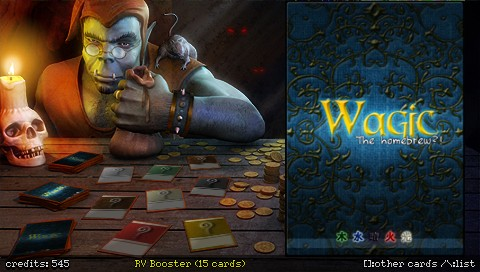

# Wagic the Homebrew

## Description

**Wagic, the Homebrew** is a C++ game engine that allows to play card games against an AI on:
- Android (phones and tablets) 
- iOS (iPhone/iPad)
- Sony PSP
- Windows desktops 
- MacOS
- Linux and derivatives like Maemo or Meego 

It is highly customizable and allows the player to tweak the rules, create their own cards, their own themes, etc... 

#### [Download from GitHub Releases!](https://github.com/WagicProject/wagic/releases)

### Documentation

Info, downloads, discussions and more at http://wololo.net/forum/index.php (archived as of 16 Nov 2022).

Chat with the community on the [**Wagic - MTG Game** Discord](https://discord.com/invite/JHK5pVaK5p) (Feb 2023).

Developer information from the [Wagic Wiki](https://github.com/WagicProject/wagic/wiki) is also included in the [wagic/docs/](docs) folder.

### Sample round play-through video

*Wagic, The Homebrew sample playthrough on YouTube by Rolz73, 6 Feb 2014*

## Sister projects

- [WagicSyntaxPlugin
](https://github.com/Vitty85/WagicSyntaxPlugin), a Wagic developer tool by Vitty85 for [Notepad++](https://notepad-plus-plus.org/downloads/)
- [Forge](https://www.slightlymagic.net/forum/viewforum.php?f=26), a Java-based game engine similar to Wagic ([Source](https://github.com/Card-Forge/forge/))
- [XMage](http://xmage.today/), a Java-based online multiplayer digital CCG ([Source](https://github.com/magefree/mage))
